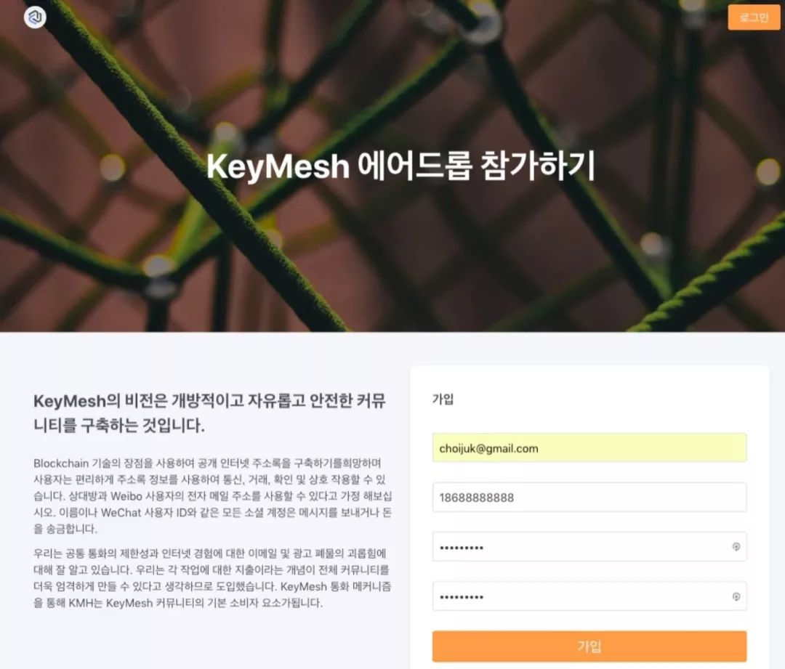

# Issue 1

## KeyMesh Manifesto

KeyMesh's long-term mission is the research and development of a Crypto-Economic Social Endowment Network.

KeyMesh's vision is a decentralized network of social endowment values. The KeyMesh token economy (KMH) forms a marketplace on top of the underlying social network, so the value of social endowment may be more transparently and efficiently allocated.

## Recents

### ◢ Development 

- Users now can join Telegram to get their KMH Token airdrop quota.

- Users now can bind their twitter handle as their social identity.

### ◢ Community

- KeyMesh annonced its Manifesto.

- KeyMesh is now starting airdrop aiming for korean.

