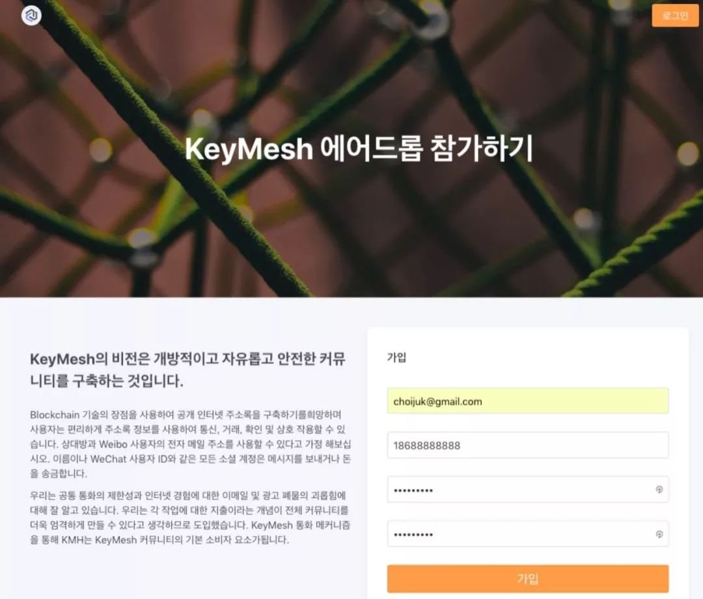

# Issue 1

## KeyMesh 宣言

KeyMesh 的目标是是赋予社交网络加密货币的经济价值 。

KeyMesh 的愿景是一个去中心化的社会禀赋价值网络。 KeyMesh 令牌经济（KMH）在社交网络的基础之上形成市场，因此社会禀赋的价值将会更加透明和有效地分配。

## 近期动态汇总

### ◢  开发进度

- 用户可以加入 Telegram 获取他们的 KMH Token 空投额度。

- 认证了地址的账户将可以通过绑定他们的 twitter 社交身份来证明他们对地址的所有权。

### ◢  社区活动

- KeyMesh 发布 Manifesto 宣言 。

- KeyMesh 官方将启动以韩国为目标的空投。

