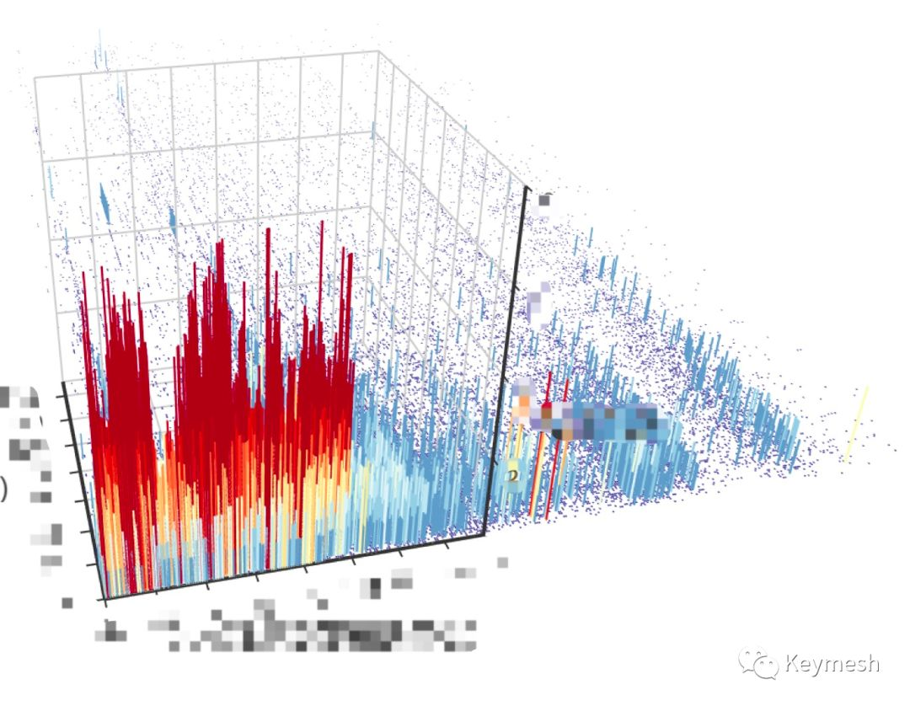

# Issue 2

## KeyMesh 代币经济设计概述

在 KeyMesh 经济中，社会禀赋价值将由不可替代、分割的 ERC721 Token 来代表，而 ERC721 Token 的价值则通过 KMH 资产来赋予。

我们称这种不可替代、分割的 ERC721 Token 为信任证书 (trust certificate)，而锁仓在证书中的 KMH Token 是其信任禀赋价值 (trust endowment)，其数量标志着社区对其社交价值认可程度的高低。

## 近期动态汇总

### ◢  开发进度

- 用户钱包地址绑定，以及新的社交账号的绑定（github，weibo）；

- 对空投的帐号进行数据分析；

- 内部在测试和调研反羊毛机器人规则，确保空投机制不被少部分人滥用，最大化广大用户的利益。

### ◢  社区活动

- KeyMesh 拟发布代币经济设计第一版；

- KeyMesh 拟对为社区做出杰出贡献的用户分发额外的KMH作为奖励，这部分 KMH 将作为社区的激励奖励由管理员直接发放；

- KeyMesh 将推出空投的英文版。